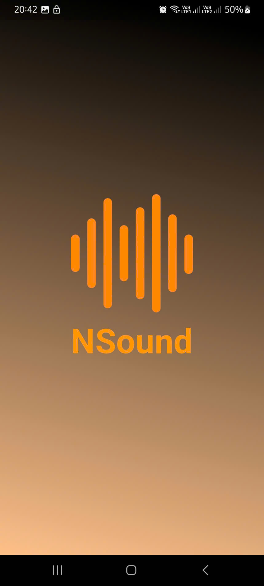
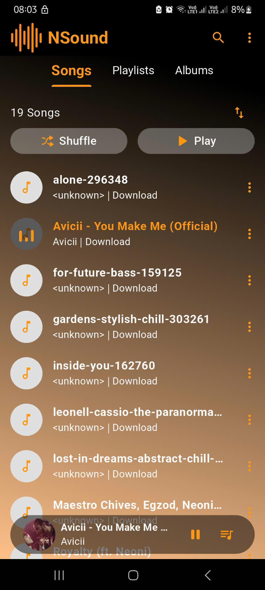
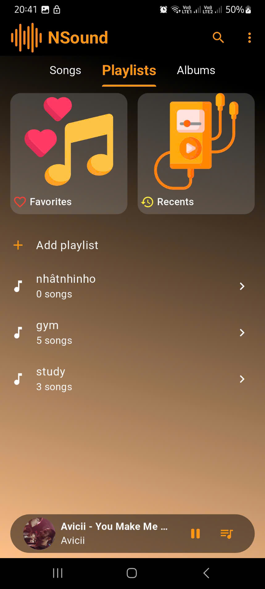
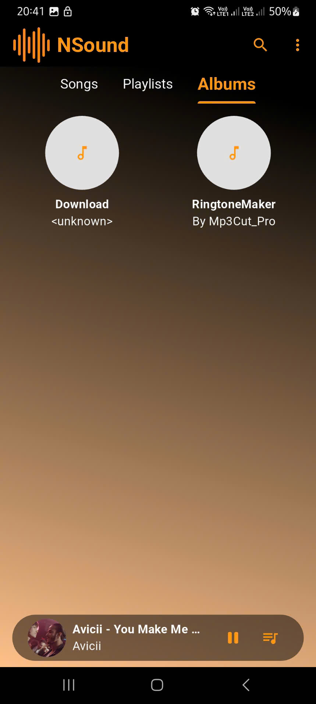
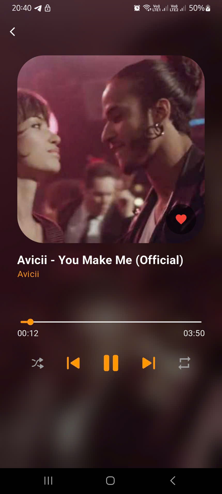
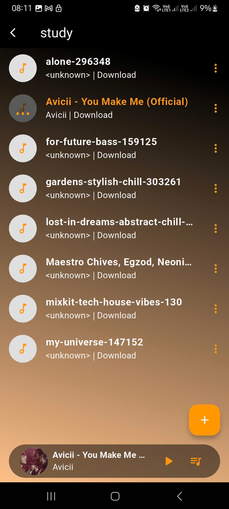

<p align="center">
  
</p>
<div align="center">
  
# NSound

</div>

### 🎧💽 a local music player app built with Flutter that allows users to listen to music locally and listen to music in phone off mode

## Screenshots

| Splash Screen | Songs Screen | Home Screen |
|--------------|--------------|--------------|
||||

| Albums Screen | Play Screen | Playlist Detail Screen |
|--------------|--------------|--------------|
||||

## Features of NSound
* BLoC for state management
* listen to music in background
* Play music from your device
* Play, pause, skip, previous, seek
* Search for music
* Themes (multiple themes) ...

## Installation

### Setup

1. Clone the repo
```git
git clone
```

2. Install dependencies
```git
dart pub get
```

3. Run the app
```git
flutter run
```


